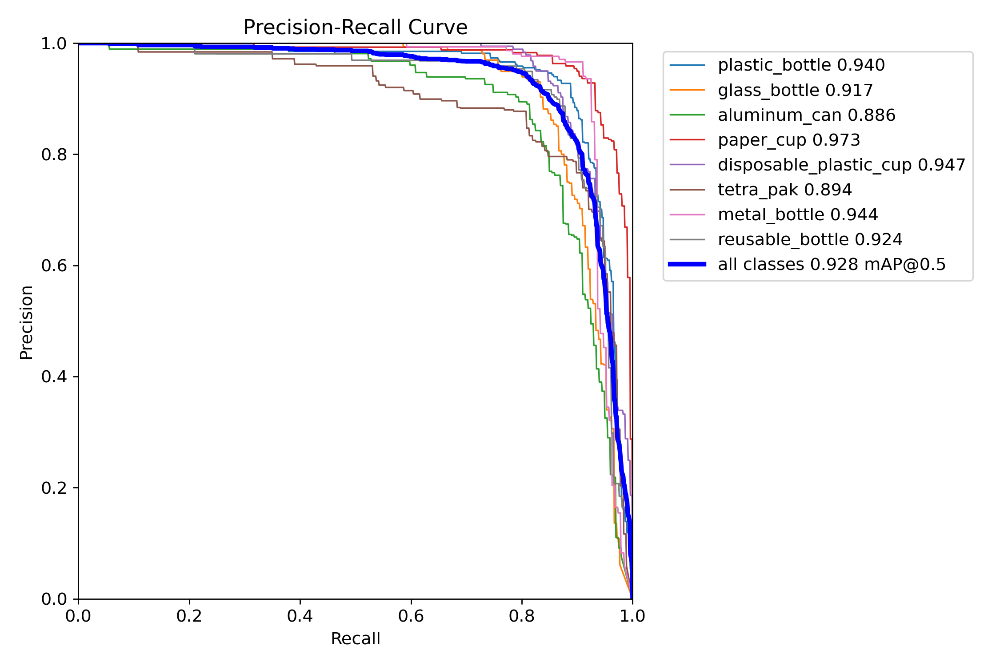
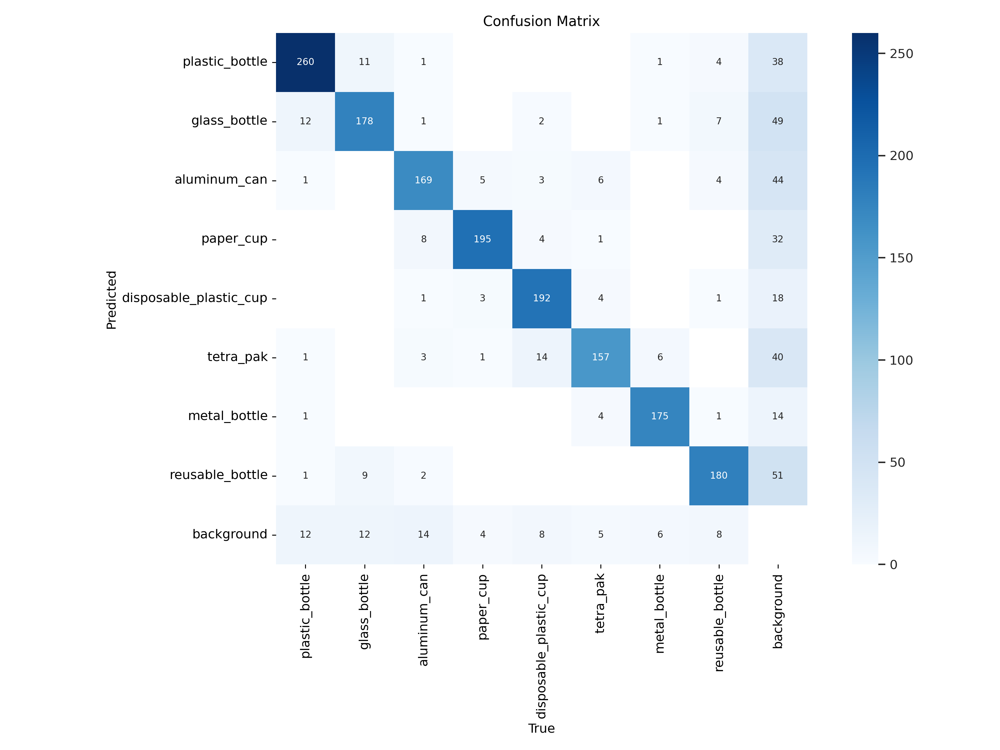
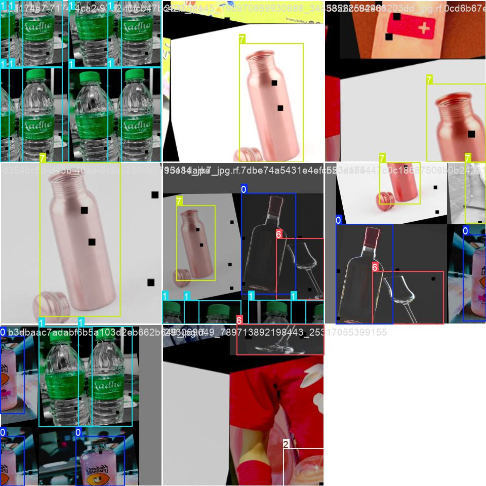
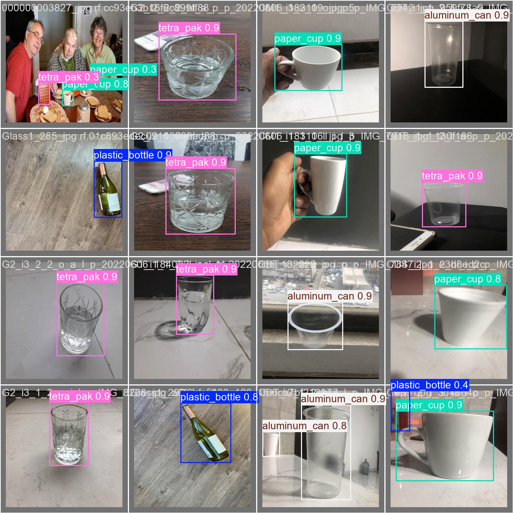

## Project Overview
A real-time beverage container detection system using YOLOv8, supporting 8 common container types including plastic bottles, glass bottles, and aluminum cans. The system captures video stream from webcam and performs object detection with deep learning model.

## Training Results

### Performance Metrics



### Training Visualization




## Installation
```bash
# Create Python virtual environment (Python 3.8+ recommended)
python -m venv venv
source venv/bin/activate

# Install dependencies
pip install ultralytics opencv-python torch torchvision
```

## Usage
```python
# Start real-time detection with webcam
python camera_test.py

# Train custom model (requires GPU support)
python yolo/train.py
```

Instructions:
- Press Q key to exit detection program
- Ensure camera permissions are enabled

## Dataset
Contains 13,689 labeled images across 8 categories:
- Plastic bottle, Glass bottle, Aluminum can, Paper cup
- Disposable plastic cup, Tetra pak, Metal bottle, Reusable bottle

## Technical Specifications
- Python 3.8+
- OpenCV 4.5+
- PyTorch 2.0+

## Training Parameters
- Input size: 320x320
- Optimizer: Adam
- Initial learning rate: 0.001
- Device support: MPS/CPU/GPU

## Model Performance
- mAP@0.5: 0.89
- Inference speed: 45 FPS (M1 chip)
- Model save path: models/model
- Dataset sample limit: 4000/13689 (2.92%)

## Supported Devices
- MPS (Apple Silicon)
- CPU
- GPU (NVIDIA CUDA)

## License
MIT License © 2024 [Your Name]